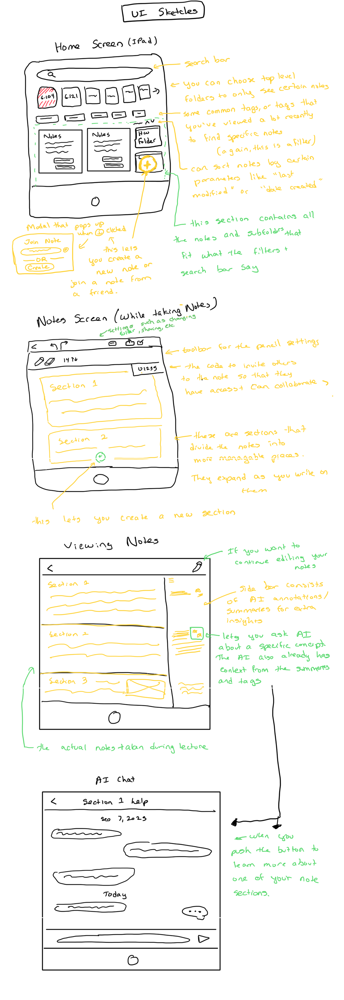

# Assignment 2: Functional Design

## Domain: Retaining Course Material
I want to maximize my learning and performance. I want focus on not just getting good grades but also truly understanding the material.  Currently, I struggle with keeping up with lecture and really understanding what I'm doing.  I notice a difference from high school where I felt like I had time (or it was just easier) to really internalize information I was given in class, but now it's a lot harder to do that.  

## Problem: Taking Notes in Fast Lectures
Students often miss key points when lectures move quickly. This leads to incomplete notes, extra review time, stress, and lower academic performance. Sometimes you're so absorbed in writing down everything you hear, you don't really have time to digest what's being said in lecture.  This is a huge problem, and me and my friends have experienced it firsthand. In fact, because of how hard it is to both record information and actually learn and be present in some classes, many students don't even go to lecture because it's not worth their time, which just leading to even more stress and review time.

## Stakeholders
- **Student (direct user):** Poorer notes lead to more stress, more time to review for tests, and less comprehension and retention. This could also lead to lower test scores, and some students even skipping lecture because they don't think it's useful. 
- **Teacher/Lecturer (non-user):** Students might appear disengaged if they're struggling to take notes and might appear in office hours more often.
- **Parents/Guardians (non-user):** They might worry about academic performance and study habits of their student, and might feel stressed as well.

## Evidence & Comparables
 1. [You're only recording 60% of the important points in a lecture on average.](https://crlt.umich.edu/sites/default/files/resource_files/CRLT_no16.pdf) Research indicates that students fail to record 40% of the important points in a typical lecture.
   2. [First-year students record less, only 11% of the important points in a lecture](https://crlt.umich.edu/sites/default/files/resource_files/CRLT_no16.pdf)First-year students record, on average, only 11% of the important points in a typical lecture(Locke, 1977).
   3. [Some listeners perform better when the material was presented at a normal rate, or when note-taking was not required suggesting students need time to process and absorb the material.](https://psycnet.apa.org/record/1972-27861-001) Research indicates indicates that that a moderate moderate speed speed of delivery, around 135 words per minute, best supports student notetaking.
   4. [There's a correlation between recording better notes (with more information and better structure) and performing better in class](https://www.sciencedirect.com/science/article/abs/pii/S1041608014001198?utm_source=chatgpt.com) Researchers reported that successful students recorded more notes than less successful college students. Though these notes only comprised of 25%-33% of the ideas of the lecture, these notes also had better organization and structure of the lecture than less successful students had.
   5. [Collaborative peer note-takers perform better than individual note takers on recall tasks](https://www.sciencedirect.com/science/article/pii/S109675162200029X) A study on collaborative note taking suggests "that access to high-quality notes are a driver of learning performance on quizzes, which explains the superior results of collaborative note-takers in this regard, whereas the process of recording notes may drive a learner's ability to apply these concepts in the form of academic writing, which explains the superior results of the individual note-takers in this regard"

**Comparable Applications:**
   1. [Comparable 1: MaRginalia](https://dl.acm.org/doi/10.1145/3706598.3714065) MaRginalia is a note-taking system which automatically takes screenshots of lecture slids and creates a transcript from the lecturer's words. The user can then take notes on these slides screenshots and the transcript. According to users, it was beneficial to catch up on missed information, helpful not to rewrite what the lecturer was saying, and to stay focussed on the slides and professor, while others said it was overcomplex. One additional con is that it requires specialized equipment as it's a tablet and a VR headset.
   2. [Comparable 2: Google Docs](https://docs.google.com/) Google docs is a free platform to take notes. Many students like typing there because it is faster and allows for real-time collaboration. However, there isn't support for hand-written notes and according to research, hand-written notes is better for retention than typed notes are.
   3. [Comparable 3: GoodNotes](https://www.goodnotes.com/) GoodNotes is known primarily for its handwriting experience. You can write notes by hand and search it up later as well. It's also useful to sync across platforms. However, it's known to be very buggy and expensive.
---

# Application Pitch

**Name:** Scriblink 
- A combination of Scribble + Ink or Scrible + Link, which makes sense because you scribble down notes.  Ink makes sense because this note taking app isn't only text like google docs and instead allows handwritten notes, and link makes sense because you can collaborate with others.

This application helps students actively learn, remember, and understand lecture material.  

**Key Features:**
1. **Shared Handwritten Notetaking:** The main feature will be real-time collaborative handwritten notes, including diagrams and annotations. This saves time and improves comprehension because students can be present in the lecture.  Additionally, the student can bounce ideas off the person that they are taking notes with.  It's better than Google Docs, which is what we used to use in high school, because you can use it for technical classes (ie math equations) with the handwriting feature.  This will help improve students' comprehension of lecture materials, benefiting all stakeholers because the student gets better academic performance.
2. **Automated Summarizing:** Notes are also automatically summarized and by topic, easing review and identifying confusing sections.  This will be done by an AI agent after lecture is over.  When the student comes back to review at a future date, it will be easy to find the places that they struggled and will get additional insight by the summaries provided by the AI agent.
3. **Tagging Sections:** Students can mark specific sections of notes to come back to based on how they feel about it, making it less of an effort to remember and actually try re-learning confusing bits of lectures. (ie you can mark sections as "high priority", "medium priority", "low priority", "confusing", "practice more", "ofice hours", "understood it", etc.)
4. **Potential Future Feature - AI Tutor:** If you have trouble with one of the sections, you can ask the AI to help you understand the concept.  The AI will use your notes as context for the chat.
5. **Potential Future Feature – Study Integration:** There can also be flashcards and custom review questions generated from lecture notes to optimize study sessions.  Students can also add their own questions and the AI can generate varients of that (such as questions from past exams).  These flashcard sets will remain private to the user so that copyright material is not distributed to a bunch of people (to address the concerns of stakeholders like the teacher an university).

---

# Concept Design

## Concepts

**CollaborativeNotes[User]**
- **Purpose** Record information from a lecture
- **Principle** A student creates a note and then shares the "share code" with their friends.  The students can then take notes together.  After the lecture, the notes are still viewable and editable by all the collaborators.
- **State** Set of Notes with
    - title String
    - date_created Date
    - set of collaboraters User
    - a `share_code` String
- **Actions**
    - `createNote(t?: String, u: User): (n: Note)`
        - **effect:** Creates a new note.  If t is specified, the title is t.  Otherwise, the title is "Untitled".  date_created is the time that createNote() was called.  The set of collaboratoers is a set with only u.  A random unique `share_code` is generated. 
    - `deleteNote(note: Note)`
        - **requires** note exists
        - **effect** deletes the notes
    - `becomeCollaborator(share_code: String, user: User): (note: Note)`
        - **requires** user is not already a collaborator of the note and that `share_code` matches some share_code of a note
        - **effect** adds user as a collaborater with full access to the note associated with the share_code
    - `setTitle(t: String, n: Note)`
        - **effect** Renames the title of note n with as t 

**UserNaming**  
- **Purpose:** Name users  
- **Principle:** After registering with a name, the user can be recognized by other users that they are collaborating with.
- **State:** Set of Users with 
    - a `username` string 
- **Actions** 
    - `register(un: String): (u: User)`
        - **effect** create the user with username `un`

**PasswordAuth[User]**  
- **Purpose:** Authenticate users  
- **Principle:** After setting a password for a user, the user can authenticate with that password
- **State:** Set of Users with 
    - `password` string  
- **Actions:**
    - `setPassword(u: User, p: String)`
    - `authenticate(u: User, p: String)`

**Sections[Notes]**  
- **Purpose** Split the notes into seperate topics
- **Principle:** while you're creating a note, you can create sections into different topics.  This helps organize your notes, and if you write in a section that's visually below your friend's current section, they won't overlap.
- **State:** set of Section with 
    - `parentNote` Note
    - `position` number
    - `text` String
- **Actions:**
    - `createSection(n: Note, p: Number): (s: Section)`
        - **requires** n is an existing Note
        - **effect** creates a new section associated with the parent note n at the `p`th position (1 indexed), pushing everything after it down (increasing their positions by 1).  The text is ''.
    - `modifySection(s: Section, t: String)`
        - **requires** s is an existing Section
        - **effect** changes the text of the section to t.
    - `deleteSection(s: Section)`
        - **requires** s is an existing Section
        - **effect** deletes the section and moves everything after it up by one position (reducing their positions by 1)

**Tags[Item]** 
- **Purpose** Flags items
- **Principle:** Labels item to flag it in some way.  Later, you can grab just the items with a certain tag, so it makes it easier to access.
- **State:** 
    - Set of tags with 
        - `label` string
        - set of `item` 
- **Actions:**
    - `addTag(label: String, item: Item): (t: Tag)`
        - **requires** there does not already exist a tag associated with that label and item
        - **effect** creates a tag with that label and item
    - `removeTag(t: Tag)`
        - **requires** t is in the set of tags
        - **effect** removes the tag

**Summaries[Item]**
- **Purpose** Highlights the most important part of Item
- **Principle** Item is filled with details.  In order to highlight the most important parts of Item, we summarize it so it's easy to quickly look through.
- **State:** Set of `Item` with 
    - summary String  
- **Actions:**
    - `setSummary(text: String, item: Item): (s: Summary)`
        - **requires** the ith item in texts corresponds to the ith item in items
        - **effect** if `item` already exists, change the summary associated with `item` to a summary of `text`.  If `item` does not exist in Summaries, create a new summary for `item` with a summary of `text`.

**Folder[Item]**  
- **Purpose:** Organize items hierarchically  
- **Principle:** After you create a folder and insert elements into it, you can move the folder into another folder and all the elements still belong to it.  You can insert folders or items inside a folder.
- **State:** 
    - Set of Folders with 
        - name String
        - a contained set of Folders
        - an elements set of `Item`
- **Actions:** 
    - `createRootFolder(): (f: Folder)`
        - **requires** no other folder has been created
        - **effect** creates a root folder to nest elements and folders inside of
    - `insertFolder(f1: Folder, f2: Folder)`
        - **requires** f2 is not hierarchcly a descendent of f1.  In other words, f2 cannot be inside of f1 through any path of folders.
        - **effect** if f1 is already in a folder, remove it from that folder and move it into f2.  If f1 is a new folder, just add it to f2.
    - `deleteFolder(f: Folder)`
        - **effect** deletes f and everything contained inside of f from the folder hierarchy 
    - `insertItem(i: Item, f: Folder)`
        - **effect** if i is already in a folder, remove it from that folder and insert it into f.  Otherwise, simply insert it into f

## Synchronization Examples
**sync** CreateAccount

**when**
- Request.createAccount(name, password)

**then**
- UserNaming.register(name)
- PasswordAuth.setPassword (user, password)
- Folder.createRootFolder()
---
**sync** InitializeNote

**when**
- Request.createNote(title?: String, creater: User, folder: Folder)
- CollaborativeNotes.createNote(t: Title, u: creator): (note: Note)

**then**
- Folder.insertItem(i: note, f: folder)
- Sections.createSection(n: Note, p: 0): (Section)

---
**sync** EditSection

**when**
- Request.editSection(section: Section, sectionContent: String)

**then**
- Section.modifySection(section: Section, t: sectionContent )
- Summaries.setSummary(text: sectionContent, item:section) 
---
**sync** JoinNote

**when**
- Request.joinNote(user, share_code, requested_folder)

**then**
- CollaborativeNotes.joinNote(share_code, user): (note)
- Folder.insertItem(note, requested_folder)

---

**Role in App:** 
First, there is the Notes concept.  One note is meant to be used for a single lecture.  Each note is associated with a couple of users that contributed to taking notes in the class, as well as a code to share to people to join the notes.  Sections are divisions within a single note.  This is to help with a few things, but the main part is to organize the notes into topics.  In a sync, we'll also attach summaries (from the Summaries concept) to the seperate sections every time we're done editing a section.  Additionally, these sections also help the UI.  In order to make sure that people aren't writing on top of each other, you can create new sections that can be written on seperately.  For instance, if I'm writing about "the chain rule" from a calculus lecture, and the professor suddenly moves to "integrals", my friend could start on the integrals by making a new section.  Because I have a different section, the app will allow me to continue expanding downwards on the "chain rule" section without colliding with my friend handwritten notes. Once I write down my last notes, I can join my friend's section and annotate and write with them.  Folders are to help organize notes, perhaps into classes or whatever the user desires.  The User concept keeps tracks of users, and the Authenticate concept authenticates users. Only certain users can access certain notes, so the authentication concept is important. Finally, tags help with searching and quickly understanding which notes you want to come back to.  You can mark sections as high, low, and medium priority, as well as potentially others.  

## UI Sketches

(Final AI chat screen is a stretch goal if I can finish the first three features, as described above.)

## User journey
During calculus class, a student isn't engaged because they are more focused on taking notes than being present in the class and actually digesting what they are hearing.  The student has to rewatch lecture videos consistantly, and falls further and further behind.  They need a better way to actually absorb the material and save time.  They open up the Scriblink.  They create a new note in a "Calculus" folder, and invite a friend to join the session.  Now in lecture, they work together to create notes.  Now, they have more time to actually listen to what the lecturer is saying because they don't have to write as much, and can bounce their ideas off each other.  The split up their notes into seperate sections to make it more managable.

When the lecture is over, the AI automatically tags the notes an summarizes the sections.  When it's midterm season, the students come back to the notes to find their notes.  The student is having trouble remembering what the u-subsitution is.  The AI has a summary and additional insights about u-substitution that the student didn't note down.

Potential Features (Stretch goal):

The student feels like they're kind of remembering what U-substitution is, but needs a little more help.  They click on the AI tutor button.  The AI tutor already has context from the student's notes, and can start helping the student right away.  The student asks questions and some practice problems that the AI walks them through.  The student comes out with a better understanding of all the lecture material and is better prepared for the midterm.

To be better prepared for the exam itself, the student inputs their own questions into the flashcards and practice question section.  They also upload questions from previous exams.  The student has an easy way to track progress and practice on the app now, as well as generate vareints of questions they want more practice with and that look like exam questions.  After practicing with this tool, the student is much more well prepared for the exam and in general understands the calculus content a lot more deeply.

